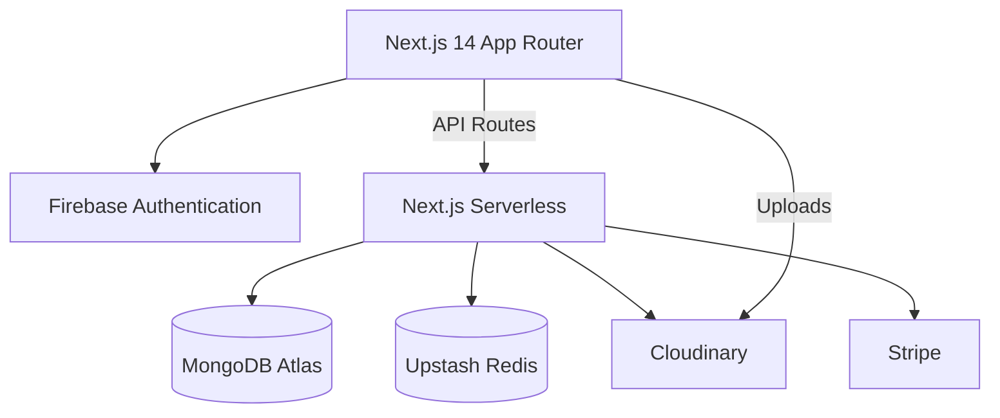

# LUXE | Premium E-Commerce Platform

A production-ready, full-stack e-commerce application built with Next.js 14, MongoDB, Firebase Auth, Redis, and Stripe.

## Tech Stack



- **Frontend:** Next.js 14 (App Router), TypeScript, Tailwind CSS, Framer Motion, Zustand
- **Backend:** Next.js API Routes (Serverless Functions)
- **Database:** MongoDB via Mongoose
- **Authentication:** Firebase Auth (Client SDK + Admin SDK)
- **Caching:** Upstash Redis (REST API)
- **Image Storage:** Cloudinary
- **Payments:** Stripe
- **Validation:** Zod + React Hook Form

## Features

- **Storefront:** Premium dark luxury design, responsive product grid, advanced filtering, search with debounce.
- **Product Details:** Image gallery, reviews, related products, variant selection.
- **Cart & Checkout:** Persistent cart (Redis + LocalStorage), multi-step checkout with Stripe integration.
- **Authentication:** Google & Email/Password login, user profiles, order history.
- **Admin Dashboard:** Analytics, product management (CRUD), order management, category management.
- **Performance:** ISR, Redis caching, image optimization, dynamic imports.

## Local Setup

1. **Clone the repository:**
   ```bash
   git clone <repo-url>
   cd ecomm-app
   ```

2. **Install dependencies:**
   ```bash
   npm install
   ```

3. **Configure Environment Variables:**
   Copy `.env.example` to `.env.local` and fill in the required values.
   ```bash
   cp .env.example .env.local
   ```

4. **Seed the Database:**
   Run the seed script to populate initial categories and products.
   ```bash
   npm run seed
   ```

5. **Start Development Server:**
   ```bash
   npm run dev
   ```
   Access the app at `http://localhost:3000`.

## Deployment

This project is optimized for deployment on **Vercel**.

1. Push your code to a Git repository.
2. Import the project in Vercel.
3. Add all environment variables from `.env.local` to Vercel project settings.
4. Deploy!

## Architecture

See [ARCHITECTURE.md](./ARCHITECTURE.md) for detailed system design.

## Decisions

See [DECISIONS.md](./DECISIONS.md) for architectural decisions log.
